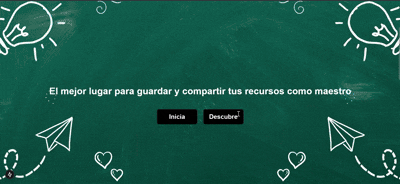
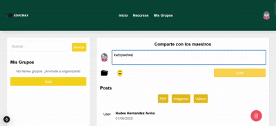
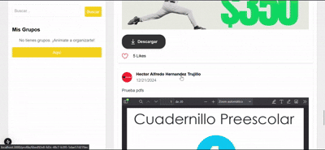
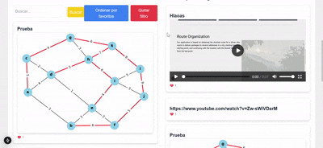
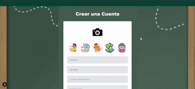

🌟 Transform Teaching Together with EducMax! 🌟
📚 Imagine a place where teachers like YOU come together to share, learn, and grow. That’s EducMax – your go-to platform for collaboration and creativity in education!

Experience a Beautifully Designed Interface with EducMax! 🎨

At EducMax, we believe that great ideas deserve a great space to shine. That’s why we’ve crafted a sleek, user-friendly interface that makes sharing and discovering resources a joy!

📂 Welcome to the Resource Hub on EducMax! 🌟

The Resource section is the heart of EducMax, where educators like YOU can share and explore materials to enhance teaching and learning. Here's what makes it so amazing:

✨ Share Your Resources
📤 Upload your lesson plans, activities, presentations, or any teaching material.
🎨 Add tags and descriptions to help others find exactly what they need.
🌍 Inspire teachers worldwide with your creative ideas!

✨ Explore & Discover
🔍 Browse through a vast library of resources shared by educators across subjects and grade levels.
📑 Filter by topic, grade, or type of resource to find the perfect fit for your classroom.
💾 Download materials in just one click and use them in your lessons.

🌟 Dive Into the World of Educators on EducMax! 🌟

On EducMax, collaboration is key! Not only can you explore incredible resources, but you can also visit other users’ profiles to discover even more inspiring materials they’ve shared. Here’s how it works:

✨ Discover User Profiles
👩‍🏫 Visit the profiles of other educators to see all the resources they’ve uploaded.
🔎 Browse their collection to find lesson plans, activities, or tools that match your needs.

🌟 Your Profile, Your Space on EducMax! 🌟

Your profile on EducMax is more than just a page – it’s your personal hub where you can manage your contributions, track your favorite resources, and customize your experience. Here’s everything you can do:

✨ View Your Contributions
📤 See all the resources you’ve uploaded in one place.
📊 Track how many likes, downloads, and views your materials have received.
🎯 Update or delete your uploads as needed to keep your content fresh and relevant.

✨ Access Your Favorites
❤️ Quickly find the resources you’ve given a like to.
⭐ Save time by revisiting materials you love without searching again.

🔑 Seamless Login & Register Experience on EducMax! 🚀

Joining the EducMax community has never been easier! Whether you’re a first-time visitor or a returning educator, our Login and Register features are designed for simplicity and security.

✨ Create Your Account in Seconds
📝 Register with just a few details: your name, email, and a secure password.
📧 Prefer convenience? Sign up with your Google or social media account!
🎨 Customize your profile right away with a photo and bio to introduce yourself to the community.

✨ Effortless Login
🔓 Returning users can log in quickly with their email and password.
🌐 Use social login options for one-click access.

